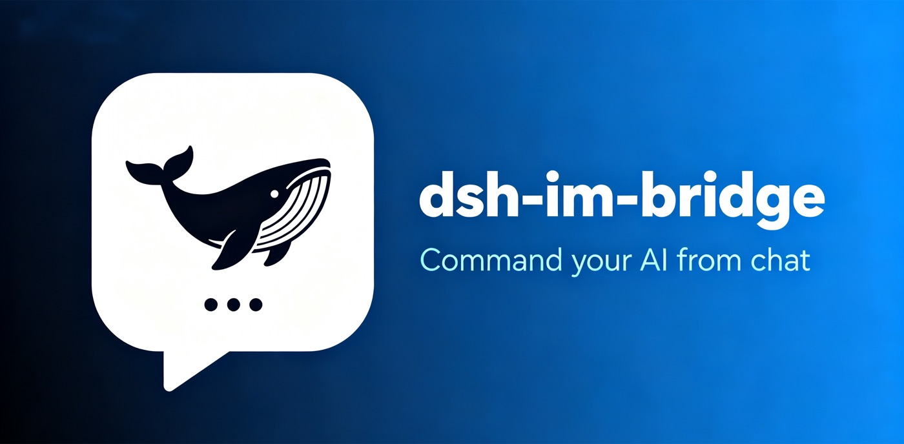

<div align="center">

<picture>
  <source media="(prefers-color-scheme: dark)" srcset="docs/banner.jpg">
  <source media="(prefers-color-scheme: light)" srcset="docs/banner.jpg">
  
</picture>

<h1>dsh-im-bridge</h1>

[](https://github.com/shaobeichen/dsh-im-bridge/stargazers)
[](https://github.com/shaobeichen/dsh-im-bridge/network/members)
[](https://github.com/shaobeichen/dsh-im-bridge/actions/workflows/ci.yml)
[](LICENSE)

**Command DeepSeek Harness from Feishu, WeCom, or Telegram: remote tasks · result notifications · risk approval**

[中文](README.md) | [English](README.en.md)

</div>

**dsh-im-bridge** is an IM channel for [DeepSeek Harness](https://github.com/deepseek-ai/deepseek-harness).
DeepSeek Harness (DSH) is an AI agent engine that runs locally on your computer — it can read and write code
in your working directory, run commands, and execute long tasks. Normally you control it through its web interface.
dsh-im-bridge adds a "remote control" to that interface: you message a bot in Feishu, WeCom, or Telegram,
those messages become instructions for DSH, and results come back to your chat.

In short: **your chat window is DSH's control panel**.

## ✨ Supported platforms

| Platform | Status | Notes |
|---|---|---|
| Feishu (Lark) | ✅ works | Official long connection, approval via card buttons, verified live |
| WeCom (WeChat Work) | ✅ works | Callback URL + message encryption, approval via text command |
| Telegram | ✅ implemented | No public webhook needed (polling), approval via buttons (bring your own bot token) |
| DingTalk | planned | — |

## 📦 What's inside

- **Chat control**: send tasks to the AI from IM, as naturally as chatting
- **Risk approval**: dangerous operations (file deletion, system commands) require your confirmation — denied by default
- **Result notifications**: tasks pushed on completion or failure, with duration and token usage
- **Full output export**: when long output is truncated, use `/log` to send the full text as a file
- **Session management**: `/new` to start, `/status` to check, `/mute` to silence notifications, and more
- **Access control**: configure who can use it and who is an admin (only admins can approve and change settings)

## 🚀 Getting started

**Prerequisite**: [DeepSeek Harness](https://github.com/deepseek-ai/deepseek-harness) installed on your computer. If `dsh` reports `command not found`, install it first:

```sh
npm install -g @deepseek-ai/dsh     # global install; verify with: dsh --version
# Don't want a global install? Prefix every command with npx: npx @deepseek-ai/dsh <command>
```

All three platforms follow the same path: **install the plugin → configure credentials → restart → chat**. No need to clone this repo or write code.

> Want all three channels at once (or one-click install from dshmarket)? `dsh plugin --profile web add github:shaobeichen/dsh-im-bridge` is equivalent to installing the core + Feishu + WeCom + Telegram together; channels without credentials just show "disconnected" and don't affect the others.

| Platform | One-command install | Prepare | Use |
|---|---|---|---|
| Feishu | `dsh plugin --profile web add dsh-im dsh-im-feishu` | Create an enterprise self-built app on the [Open Platform](https://open.feishu.cn/app), get App ID / App Secret ([guide](docs/feishu-setup.md)) | Configure credentials, restart `dsh web`, private-chat the bot: `/new` → send tasks; risky operations send an approval card — tap a button |
| WeCom | `dsh plugin --profile web add dsh-im dsh-im-wecom` | Create a self-built app in the [admin console](https://work.weixin.qq.com/wework_admin/frame), get CorpID / AgentId / Secret, configure callback URL and Trusted IP ([guide](docs/wecom-setup.md)) | Configure credentials, restart `dsh web`, open the app from "Workbench": `/new` → send tasks; approval comes as text — reply `/approve <id> yes` (no buttons) |
| Telegram | `dsh plugin --profile web add dsh-im dsh-im-telegram` | Create a bot with [@BotFather](https://t.me/BotFather), get the token ([guide](docs/telegram-setup.md)) | Configure credentials, restart `dsh web`, private-chat the bot: `/new` → send tasks; risky operations send an approval card — tap a button |

> Credentials go in environment variables (`FEISHU_APP_ID`, `WECOM_CORP_ID`, `TELEGRAM_BOT_TOKEN`, etc.). See each platform's setup doc for details.

> [!NOTE]
> Want to run the integration scripts **without installing into DSH** (requires cloning the repo + Node.js 22+)? See the demo runners under "For developers" below.

## 🗂 Package layout

| Directory | Description |
|---|---|
| packages/im | Core: message handling, sessions, approvals, notifications |
| packages/im-telegram | Telegram adapter |
| packages/im-feishu | Feishu adapter |
| packages/im-wecom | WeCom adapter |
| demo | Demo and runner scripts |
| docs | Documentation |

## 🧭 Architecture

Message flow:

```
Message from your IM
      ↓
Channel adapter (converts platform message to a unified format)
      ↓
Core dsh-im (command or task? session management, approvals)
      ↓
DeepSeek Harness (does the actual work)
      ↓
Result sent back to your chat
```

For more, see the [docs index](docs/README.md).

## 🤝 For developers

- Want to modify code or add a channel? Start with [CONTRIBUTING.md](CONTRIBUTING.md)
- Repo rules for AI agents: [AGENTS.md](AGENTS.md)
- Original product spec: [docs/PRD-v0.5.md](docs/PRD-v0.5.md)

**Run the integration scripts without installing into DSH?** (clone this repo + Node.js 22+)

```sh
node demo/mock-demo.mjs                  # terminal-only mock IM
node demo/feishu-real.mjs --mode demo    # live Feishu (needs FEISHU_APP_ID/SECRET)
node demo/wecom-real.mjs --mode demo     # live WeCom (needs WECOM_* credentials)
node demo/telegram-real.mjs --mode demo  # live Telegram (needs TELEGRAM_BOT_TOKEN)
```

## 🔒 Security

This project executes remote instructions and touches real files, so security is a priority. The core principle: denied by default, risky operations require your approval. Security model and vulnerability reporting: [SECURITY.md](SECURITY.md).

**End users don't configure anything security-related**: everyone is denied by default, and a stranger's first message triggers a trust confirmation — the admin (a user listed in `security.admins`) taps ✅ or replies `/trust` to let them in, permanently. The admin configures their own key once.

## 📄 License

MIT
